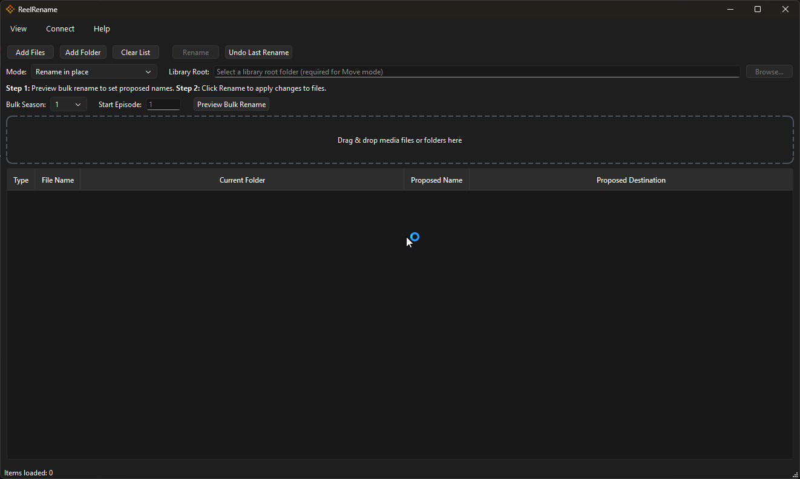

# 🎬 ReelRename

**ReelRename** is a fast, cross-platform desktop application for organizing and renaming movie, anime, and TV media files using clean, consistent naming conventions.

Built with **Python + PySide6**, ReelRename is designed to replace fragile bash scripts and manual renaming workflows with a reliable, preview-first GUI tool.

---

<p align="center">
  
  <br>
  <em>Main interface showing preview-first renaming workflow</em>
</p>


---

## ✨ Key Features

- 📂 Drag & drop files **or entire folders**
- 🧠 Smart media detection (Movie / TV / Anime)
- 🏷️ Automatic title + year resolution (via TMDB)
- 👀 Preview **Proposed Name** before renaming
- 🔁 Undo last rename operation
- 📁 Rename in place **or** move into a structured library
- 🌙 Modern dark UI (built for long sessions)
- 🪟 Native installers for Linux and Windows

---

## 🖥️ Supported Platforms

| Platform | Status |
|--------|--------|
| Linux (x86_64) | ✅ AppImage |
| Windows (x64) | ✅ Installer (.exe) |
| macOS | ⏳ Planned |

---

## 📦 Installation

### 🔹 Windows (Recommended)
1. Download `ReelRename-Setup.exe` (v1.2.13) from the **Releases** page
2. Double-click the installer
3. Follow the setup wizard
4. Launch ReelRename from the Start Menu

> ⚠️ Windows SmartScreen may warn about an unknown publisher.  
> Click **More info → Run anyway** (normal for unsigned apps).

---

### 🔹 Linux (AppImage)
1. Download `ReelRename-x86_64.AppImage` (v1.2.13)
2. Make it executable:
   ```bash
   chmod +x ReelRename-x86_64.AppImage

### 🔑 TMDB API Key Setup (Required for Metadata)

> ReelRename uses The Movie Database (TMDB) to resolve accurate movie and TV show titles, release years, and metadata.
> To enable full metadata features, you must provide your own free TMDB API key.

## 📌 Step 1: Create a TMDB Account

   >  Visit https://www.themoviedb.org/
   >  Sign up for a free account (or log in if you already have one)

## 📌 Step 2: Request an API Key

  > Go to https://www.themoviedb.org/settings/api
  > Click Create under API Key
  > Select Developer
  > Complete the short application form
    (Example description: Personal media organization tool)
  Once approved, you will receive an API Key (v3 auth).

## 📌 Step 3: Add the API Key in ReelRename

  > Launch ReelRename
  > Open the menu:
    [Connect → TMDB API Key]
  > Paste your API key and save

## 📂 Where the API Key Is Stored
Your API key is stored locally on your machine, per user:
    
    Windows
    C:\Users\<your-username>\.reelrename\config.json

    Linux
    /home/<your-username>/.reelrename/config.json

The key is never uploaded, logged, or shared.

## ⚠️ Notes

    A TMDB API key is required for:

        Automatic title matching

        Accurate release year detection

        Media classification (Movie / TV / Anime)

    Without an API key, ReelRename will still rename files, but metadata enrichment will be disabled.

